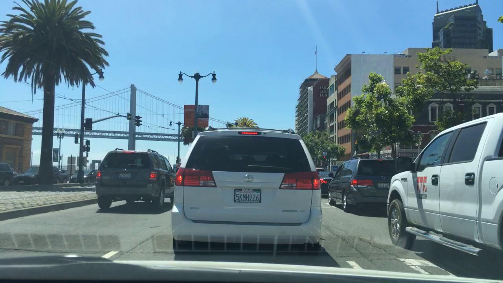
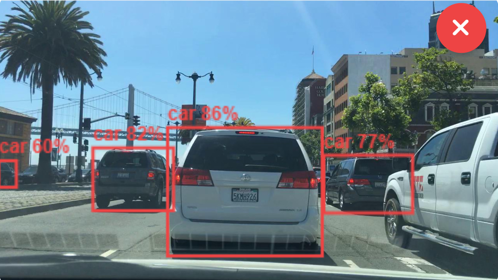
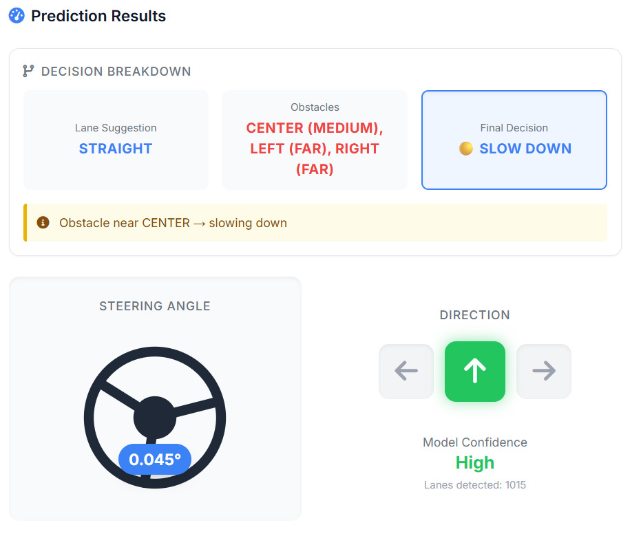
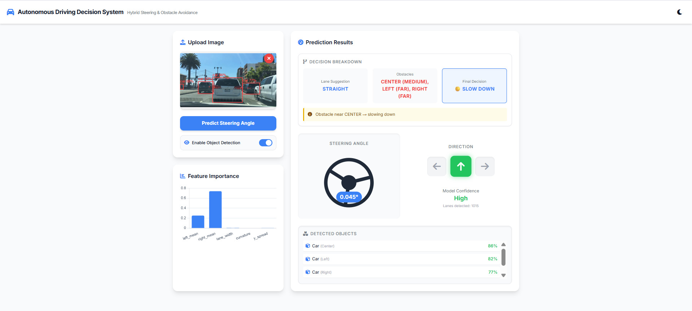

# 🚗 Black-Box Testing for Autonomous Driving System

A full-stack web application that simulates an autonomous driving decision system. It combines a Machine Learning model for lane-based steering angle prediction with a YOLOv8 object detection system to make intelligent, real-time safety overrides (such as slowing down or stopping).

---

## 📸 Demo

### Input Image



### Output (Detection + Decision)




### Dashboard UI



---

## ✨ Features

* **Hybrid AI Logic:** Combines Machine Learning (Random Forest) for steering prediction with Deep Learning (YOLOv8) for real-time object detection.
* **Robustness Testing:** Evaluates performance under different conditions like rain, fog, snow, and night.
* **Intelligent Decision Engine:** Uses bounding box area and position to override unsafe steering decisions.
* **Interactive UI:** Real-time dashboard with steering animation and visual bounding boxes.
* **FastAPI Backend:** High-performance API for seamless frontend-backend communication.

---

## 🛠️ Tech Stack

* **Backend:** Python, FastAPI, Uvicorn, OpenCV
* **Machine Learning:** Scikit-learn (Random Forest), Ultralytics YOLOv8
* **Frontend:** HTML, CSS, JavaScript
* **Visualization:** Chart.js

---

## 📁 Project Structure

```
backend/        # FastAPI backend + ML models  
frontend/       # UI files  
dataset/        # (not included due to size)  
assets/         # Images used in README  
README.md  
.gitignore  
```

---

## 📂 Dataset

The dataset used for training is not included in this repository due to size constraints.

👉 Download here: **https://www.kaggle.com/datasets/solesensei/solesensei_bdd100k**

---

## ⚙️ Installation & Setup

### 1. Clone the Repository

```bash
git clone https://github.com/harshit1525/Black-Box_Testing_For_Autonomous_Driving.git
cd Black-Box_Testing_For_Autonomous_Driving
```

### 2. Create Virtual Environment

```bash
python -m venv .venv

# Windows
.venv\Scripts\activate

# Mac/Linux
source .venv/bin/activate
```

### 3. Install Dependencies

```bash
cd backend
pip install -r requirements.txt
```

### 4. Run the Server

```bash
uvicorn main:app --reload
```

### 5. Open the Application

```
http://127.0.0.1:8000/static/index.html
```

---

## 🧠 How It Works (Pipeline)

1. **Upload Image:** User uploads a driving scene via the web interface.
2. **Lane Detection:** OpenCV extracts lane features.
3. **Steering Prediction:** Random Forest predicts direction (Left/Right/Straight).
4. **Object Detection:** YOLOv8 detects obstacles like vehicles and pedestrians.
5. **Decision Engine:** Combines both outputs to override unsafe actions (Slow Down / Stop).

---

## 🎯 Example Output

* **Steering Prediction:** Left
* **Detected Object:** Car
* **Final Decision:** Slow Down

---

## 🚀 Future Improvements

* Real-time video processing
* Integration with autonomous driving simulators
* Deployment using cloud services

---

## 📌 Conclusion

This project demonstrates how **Black-Box Machine Learning models** can be combined with **rule-based safety logic** to improve decision-making in autonomous driving systems.

---

## 👨‍💻 Contributors

- Harshit Gupta  
- Arushi Sharma  
